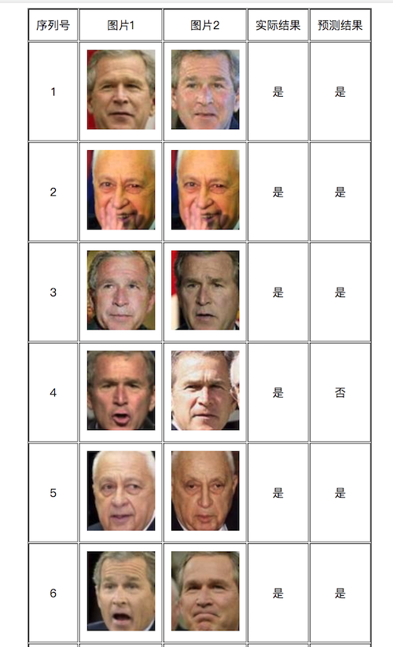

### Face Recognition
#### Preview:    

     

    
**25 same, and another 25 different pairs**     

#### Based on:   
1. [django](https://github.com/django/django)
2. [center loss](https://github.com/ydwen/caffe-face)
3. [mtcnn face detection and alignment](https://github.com/kpzhang93/MTCNN_face_detection_alignment)

## 基于深度学习的人脸检测、识别
###	项目名称
基于深度学习的人脸检测、识别
### 问题描述
首先用`mtcnn(参考文献1)`对人脸进行对齐和检测，也就是从数据集中将人脸抠出来。然后用 `softmax_loss+center_loss(参考文献2)`进行人脸识别。

### 数据集
训练集[CASIA-WebFace](http://www.cbsr.ia.ac.cn/english/CASIA-WebFace-Database.html)。我的百度云下载链接，链接: https://pan.baidu.com/s/1boWY8aj  密码:71kw。官网下载需要申请，时间比较长，[官网链接](http://www.cbsr.ia.ac.cn/english/CASIA-WebFace-Database.html)。
测试集: [Labeled Faces in the Wild Home]( http://vis-www.cs.umass.edu/lfw/)。

###	算法选择和原理描述
我们主要选择的算法是`mtcnn`和`center_loss`。
#### mtcnn
* 算法流程
mtcnn分为三个阶段: 

    

  

    1. stage1: 在构建图像金字塔的基础上，利用`fully convolutional network`来进行检测，同时利用`boundingbox regression`和NMS来进行修正。（注意：这里的全卷积网络与`R-CNN`里面带反卷积的网络是不一样的，这里只是指只有卷积层，可以接受任意尺寸的输入，靠网络`stride`来自动完成滑窗）

    2. stage2: 将通过stage1的所有窗口输入作进一步判断，同时也要做`boundingbox regression`和NMS。

    3. stage3: 和stage2相似，只不过增加了更强的约束：5个人脸关键点。

* 网络结构描述
    * Proposal Net(P-Net)

    

  

该网络结构主要获得了人脸区域的候选窗口和边界框的回归向量。并用该边界框做回归，对候选窗口进行校准，然后通过`非极大值抑制（NMS）`来合并高度重叠的候选框。
    * Refine Network(R-Net)

    

  

该网络结构还是通过边界框回归和NMS来去掉那些`false-positive`区域。
只是由于该网络结构和P-Net网络结构有差异，多了一个全连接层，所以会取得更好的抑制false-positive的作用。
    * Output Network(O-Net)

    

  

该层比R-Net层又多了一层卷基层，所以处理的结果会更加精细。作用和R-Net层作用一样。但是该层对人脸区域进行了更多的监督，同时还会输出5个地标`（landmark）`。

#### center_loss
对于`center_loss`算法，主要是在`softmax_loss`的基础上，通过对训练集的每个类别在特征空间分别维护一个类中心，在训练过程中，增加样本经过网络映射后在特征空间与类中心的距离约束，从而兼顾类内聚合与类间分离。

    

  

整体流程就是读取输入的图像，然后做个前向传播，应用`softmax_loss+center_loss`学习到`Discriminative Features`，然后进行标签的预测。
`softmaxloss`可以实现将2个类别分开，`center_loss`可以实现减少类类距离，增加类间距离的效果，有点类似，线性判别分析`LDA（Linear Discriminant Analysis）`的思想。在效果上优于`contrastive_loss`和`triplet_loss`，解决了这2个方法在采样问题中的trick。

* softmax_loss如下:

    

  

* centerloss:

    

  

* 实验表明只使用centerloss效果很一般，所以一般是将centerloss与softmax结合起来,引入参数lambda。

    

  

* 总体结构如下:

    

  

* 算法过程:

    

* 算法效果
在论文中，实际的`mnist`测试效果如下图所示：
左图为不加`center_loss`的效果，右图为加了`center_loss`的效果。可见效果确实是不错的。

    

最后，测试2张人脸图像的相似性，直接计算`cosine_distance(余弦距离)`，简单的理解，2个特征向量越相似，夹角就会越小，余弦距离就会越大，也就是2个人脸越相似。
余弦距离公式:

    

  

### 参考文献    
1. 《Joint Face Detection and Alignment using Multi-task Cascaded Convolutional Networks》, [arxiv地址](https://arxiv.org/abs/1604.02878v1)  
2. 《A Discriminative Feature Learning Approach for Deep Face Recognition》, [eccv地址](https://link.springer.com/chapter/10.1007/978-3-319-46478-7_31)
